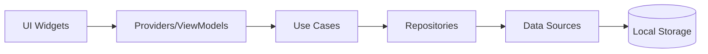

<p align="center">
  
</p>

<h1 align="center">Röle</h1>

<p align="center">
  <strong>A modern, cross-platform API testing client built with Flutter</strong>
</p>

<p align="center">
  <a href="#features">Features</a> •
  <a href="#screenshots">Screenshots</a> •
  <a href="#installation">Installation</a> •
  <a href="#getting-started">Getting Started</a> •
  <a href="#architecture">Architecture</a> •
  <a href="#contributing">Contributing</a> •
  <a href="#license">License</a>
</p>

---

## Overview

**Röle** (Turkish for "Relay") is a lightweight, modern API client designed for developers who need a fast, cross-platform tool for testing REST APIs. Built with Flutter and following clean architecture principles, Röle offers a beautiful native experience on Windows, macOS, Linux, Android, and iOS.

Whether you're debugging backend endpoints, testing microservices, or documenting API behavior, Röle provides an intuitive interface with powerful features like environment variable substitution, request collections, and Postman import support.

## Features

### Core Functionality
- 🚀 **Full HTTP Method Support** - GET, POST, PUT, DELETE, PATCH, HEAD, and OPTIONS
- 📝 **Request Editor** - Intuitive interface for composing requests with headers, query parameters, and body
- 📊 **Response Viewer** - Beautiful formatted JSON/HTML response display with syntax highlighting
- ⏱️ **Performance Metrics** - Track response times and status codes
- 🔄 **Request History** - Review up to 20 history entries per request

### Organization
- 📁 **Collections** - Organize requests into logical groups
- 🌍 **Environments** - Define variables for different environments (development, staging, production)
- 🔗 **Variable Substitution** - Use `{{variableName}}` syntax to dynamically inject environment values into URLs, headers, and bodies

### Import/Export
- 📥 **Postman Import** - Seamlessly import Postman collections and environments
- 📤 **Workspace Export** - Export your entire workspace (collections, requests, environments) as JSON
- 🔀 **Conflict Resolution** - Smart handling of naming conflicts during import (skip, keep both, or overwrite)

### User Experience
- 🎨 **Modern Design** - Clean, Material Design 3 interface with carefully crafted theming
- 🌙 **Dark Mode** - Full dark theme support for comfortable late-night debugging
- 📱 **Responsive Layout** - Adapts beautifully from mobile to desktop screen sizes
- ⚡ **Fast & Native** - Compiled to native code for each platform

### Cross-Platform
- 💻 Windows, macOS, Linux desktop support
- 📱 Android and iOS mobile support

## Screenshots

<!-- TODO: Add screenshots of the application -->
*Coming soon*

## Installation

### Prerequisites

- [Flutter SDK](https://docs.flutter.dev/get-started/install) (version 3.9.2 or higher)
- For desktop: Platform-specific development tools
  - **Windows**: Visual Studio 2022 with C++ workload
  - **macOS**: Xcode 14+
  - **Linux**: Required packages (see [Flutter Linux docs](https://docs.flutter.dev/get-started/install/linux))

### From Source

1. **Clone the repository**
   ```bash
   git clone https://github.com/battletech45/relay.git
   cd relay
   ```

2. **Install dependencies**
   ```bash
   flutter pub get
   ```

3. **Run the application**
   ```bash
   # For desktop (macOS/Windows/Linux)
   flutter run -d macos
   flutter run -d windows
   flutter run -d linux

   # For mobile
   flutter run -d android
   flutter run -d ios
   ```

### Build for Release

```bash
# Windows
flutter build windows --release

# macOS
flutter build macos --release

# Linux
flutter build linux --release

# Android APK
flutter build apk --release

# iOS
flutter build ios --release
```

### Pre-built Releases

Check the [Releases](https://github.com/battletech45/relay/releases) page for pre-built binaries for Windows.

## Getting Started

### Creating Your First Request

1. Launch Röle
2. Click the **"New Request"** floating action button
3. Enter a name for your request (e.g., "Get Users")
4. Select the HTTP method (GET, POST, etc.)
5. Enter the URL (e.g., `https://jsonplaceholder.typicode.com/users`)
6. Click **"Send"** to execute the request
7. View the response in the **Response Body** tab

### Using Environment Variables

Environment variables let you switch between different API endpoints or authentication tokens without modifying your requests.

1. Open the **drawer menu** (hamburger icon)
2. Click **"Create Environment"**
3. Add variables like:
   - `baseUrl` → `https://api.example.com`
   - `apiKey` → `your-api-key-here`
4. Select the environment from the **environment dropdown** in the app bar
5. Use variables in your requests with the `{{variableName}}` syntax:
   - URL: `{{baseUrl}}/users`
   - Header: `Authorization: Bearer {{apiKey}}`

### Organizing with Collections

1. Open the **drawer menu**
2. Click **"Create Collection"**
3. Name your collection (e.g., "User API")
4. When creating new requests, select the collection from the dropdown
5. Filter requests by collection using the **collection selector** in the app bar

### Importing from Postman

1. Export your Postman collection (Collection v2.1 format recommended)
2. Open the **drawer menu** in Röle
3. Click **"Import Workspace"**
4. Select your `.json` file
5. Handle any conflicts if prompted
6. Your collections and environments are now imported!

## Architecture

Röle follows **Clean Architecture** principles with a feature-based structure:

```
lib/
├── core/                    # Shared code across features
│   ├── constant/           # App constants
│   ├── model/              # Core data models
│   │   ├── api_request_model.dart
│   │   ├── collection_model.dart
│   │   ├── environment_model.dart
│   │   ├── request_result_model.dart
│   │   └── workspace_bundle.dart
│   ├── service/            # Core services
│   │   ├── api_service.dart
│   │   ├── environment_service.dart
│   │   ├── file_storage_service.dart
│   │   ├── theme_service.dart
│   │   └── workspace_import_export_service.dart
│   ├── theme/              # App theming
│   └── util/               # Utilities
├── features/
│   └── home/
│       ├── data/           # Data layer
│       │   ├── datasources/
│       │   └── repositories/
│       ├── domain/         # Domain layer
│       │   ├── repositories/
│       │   └── usecases/
│       └── presentation/   # Presentation layer
│           ├── controllers/
│           ├── providers/
│           ├── viewmodels/
│           └── widgets/
├── ui/                     # Reusable UI components
│   ├── layout/
│   └── widgets/
└── main.dart
```

### Key Technologies

| Technology | Purpose |
|------------|---------|
| [Flutter](https://flutter.dev) | Cross-platform UI framework |
| [Riverpod](https://riverpod.dev) | State management |
| [Dio](https://pub.dev/packages/dio) | HTTP client |
| [SharedPreferences](https://pub.dev/packages/shared_preferences) | Local key-value storage |
| [PathProvider](https://pub.dev/packages/path_provider) | File system paths |
| [FilePicker](https://pub.dev/packages/file_picker) | File selection dialogs |

### Data Flow



## Configuration

### App Constants

Key configuration values are defined in `lib/core/constant/app_constants.dart`:

| Constant | Default Value | Description |
|----------|---------------|-------------|
| `appName` | Röle | Application display name |
| `defaultConnectTimeout` | 15 seconds | HTTP connection timeout |
| `defaultReceiveTimeout` | 30 seconds | HTTP receive timeout |
| `maxHistoryEntriesPerRequest` | 20 | Maximum saved history per request |
| `variableStart` / `variableEnd` | `{{` / `}}` | Environment variable syntax |

### Supported HTTP Methods

- `GET` - Retrieve resources
- `POST` - Create resources
- `PUT` - Update/replace resources
- `DELETE` - Remove resources
- `PATCH` - Partial update resources
- `HEAD` - Retrieve headers only
- `OPTIONS` - Discover allowed methods

## Development

### Running Tests

```bash
flutter test
```

### Code Style

This project uses Flutter's recommended lint rules. Check and fix issues with:

```bash
flutter analyze
```

### Generating App Icons

App icons are managed via `flutter_launcher_icons`:

```bash
flutter pub run flutter_launcher_icons
```

## Contributing

Contributions are welcome! Here's how you can help:

1. **Fork** the repository
2. **Create** a feature branch (`git checkout -b feature/amazing-feature`)
3. **Commit** your changes (`git commit -m 'Add amazing feature'`)
4. **Push** to the branch (`git push origin feature/amazing-feature`)
5. **Open** a Pull Request

### Guidelines

- Follow the existing code style and architecture patterns
- Write meaningful commit messages
- Add tests for new features when applicable
- Update documentation as needed

## Roadmap

- [ ] Request history with response snapshots
- [ ] Syntax highlighting for request/response bodies
- [ ] GraphQL support
- [ ] WebSocket testing
- [ ] gRPC support
- [ ] Request chaining and scripting
- [ ] Team collaboration features
- [ ] API documentation generation

## FAQ

### Why "Röle"?

"Röle" means "Relay" in Turkish. Just as a relay passes signals forward, Röle relays your API requests and brings back responses!

### How is data stored?

All data is stored locally on your device using the platform's standard storage mechanisms:
- **Desktop**: Application documents directory
- **Mobile**: Application-specific storage

No data is ever sent to external servers.

### Can I use this for GraphQL APIs?

Currently, Röle focuses on REST APIs. GraphQL support is on the roadmap for future releases.

## License

This project is licensed under the MIT License - see the [LICENSE](LICENSE) file for details.

---

<p align="center">
  Made with ❤️ and Flutter
</p>
