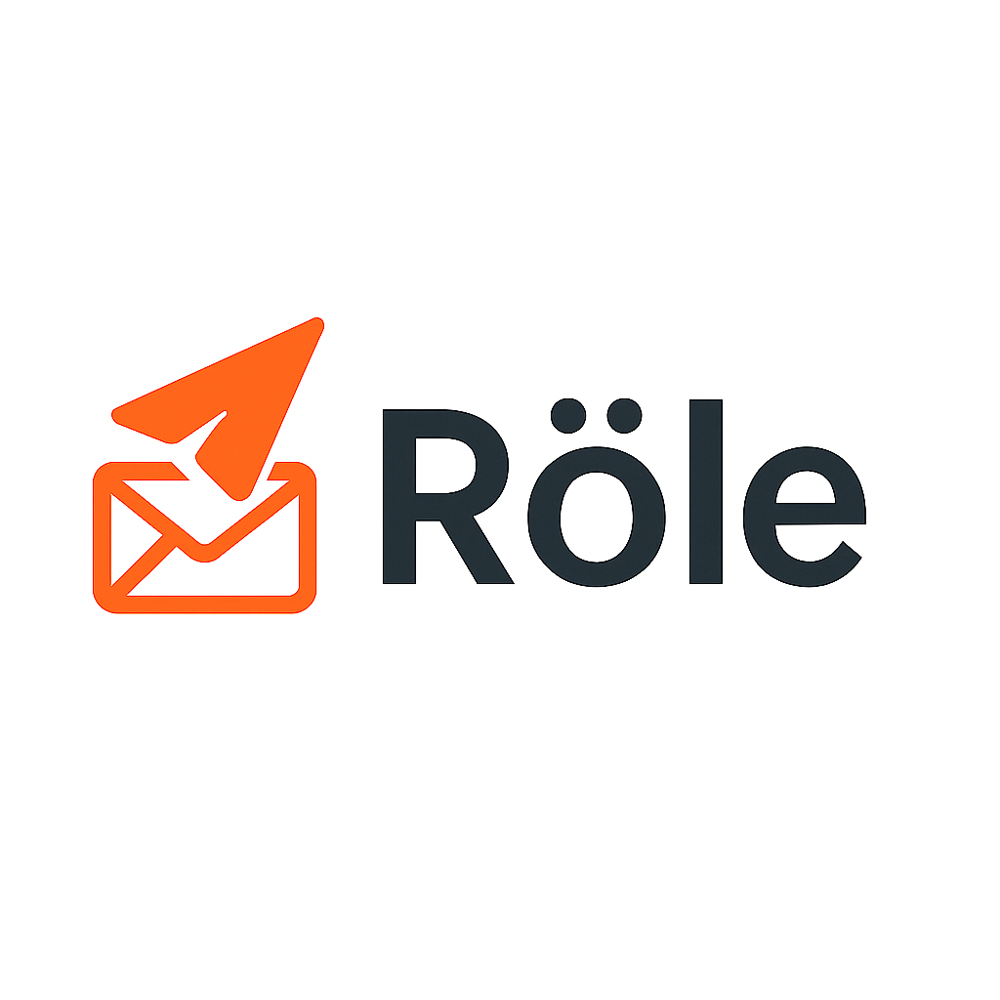
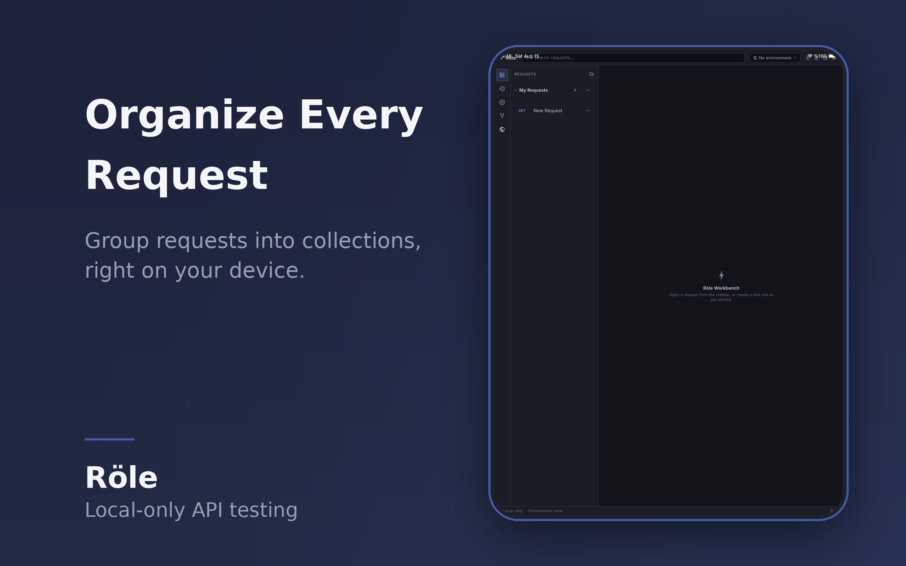
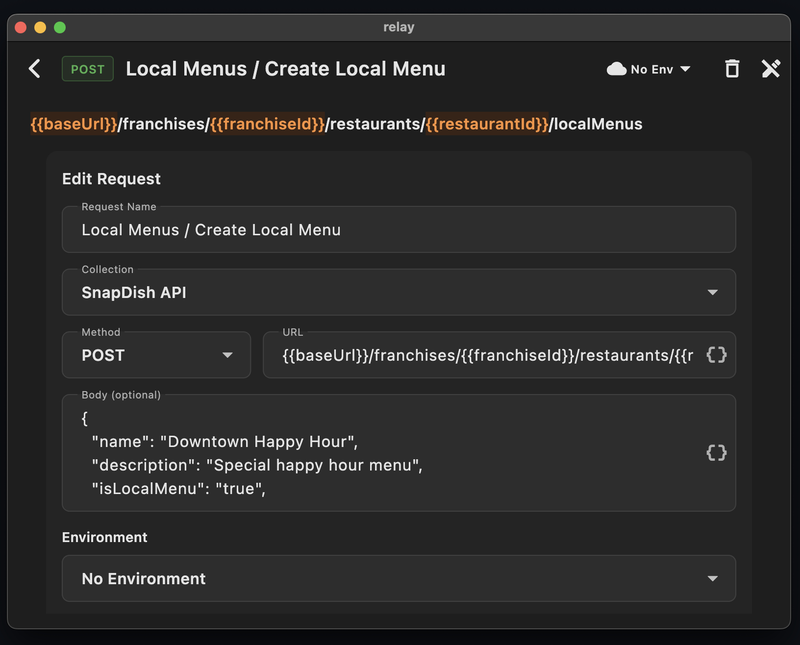
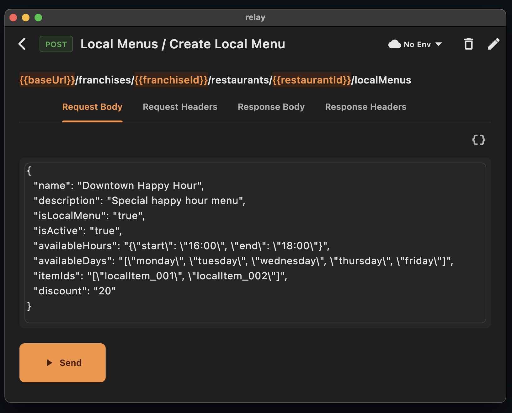
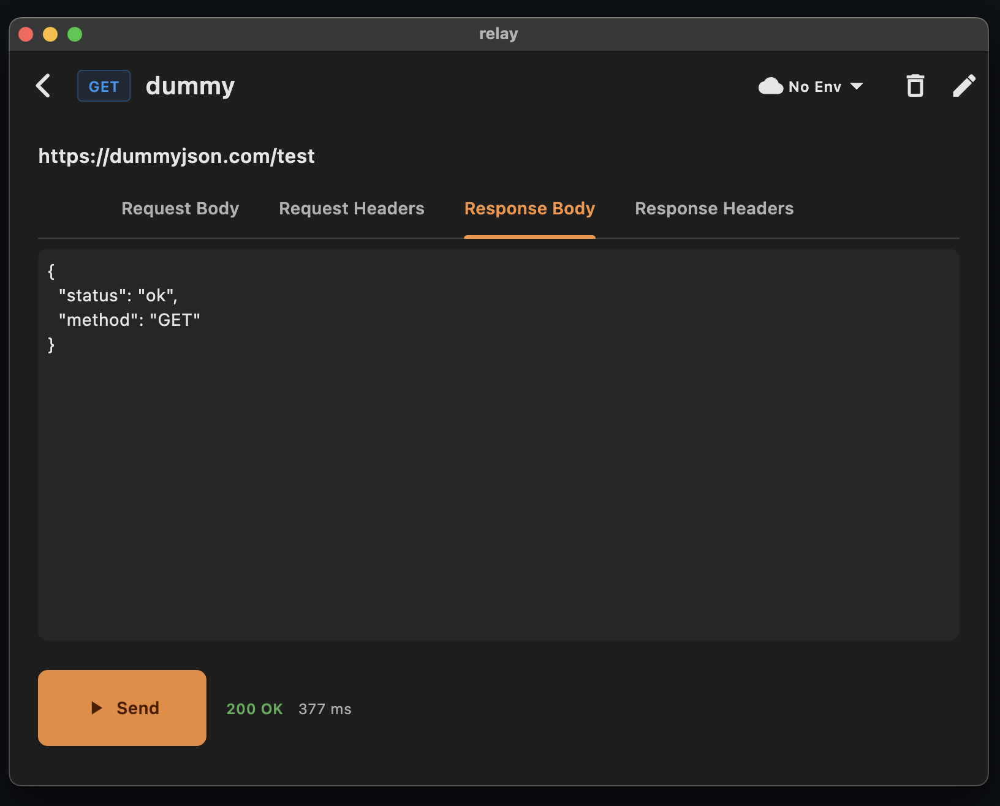
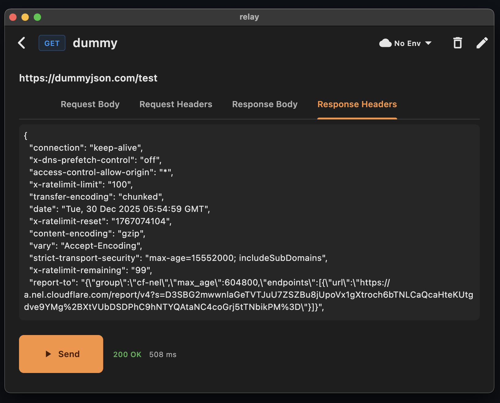

<p align="center">
  
</p>

<h1 align="center">Röle</h1>

<p align="center">
  <strong>A modern, cross-platform, local-only API testing client built with Flutter</strong>
</p>

<p align="center">
  <a href="#overview">Overview</a> •
  <a href="#features">Features</a> •
  <a href="#screenshots">Screenshots</a> •
  <a href="#installation">Installation</a> •
  <a href="#getting-started">Getting Started</a> •
  <a href="#architecture">Architecture</a> •
  <a href="#technical-documentation">Docs</a> •
  <a href="#contributing">Contributing</a> •
  <a href="#license">License</a>
</p>

---

## Overview

**Röle** is a lightweight, local-only API client for testing REST endpoints across desktop and mobile platforms.

All collections, requests, and environments are stored on your device. There is no account, no sign-in, and no backend server — Röle never talks to anything except the endpoints you point it at.

## Features

### API Requesting

- HTTP methods: `GET`, `POST`, `PUT`, `DELETE`, `PATCH`, `HEAD`, `OPTIONS`
- Request editor with URL, headers, query params, and body
- Response viewer with status, headers, body formatting, and timing
- Per-request history snapshots

### Organization and Reuse

- Collections to organize request sets
- Environment variables with `{{variableName}}` substitution
- Active collection and environment selectors
- Request search/filter on home screen

### Import and Export

- Import workspace JSON (Röle and Postman-style exports)
- Conflict handling during import (`Skip`, `Keep both`, `Overwrite`)
- Export workspace JSON from the app

### Execution and Automation

- **Collection Runner**: run all requests in a collection sequentially
- **Run History**: inspect previous test runs with pass/fail summaries
- **Request Chain (Flows)**: compose multi-step chained request execution with delays and previous-response passing

### UX and Platform

- Material 3 UI with responsive desktop/mobile layout
- Light, dark, and system theme modes
- Supported platforms: Windows, macOS, Linux, Android, iOS

## Screenshots

### Home Screen

<p align="center">
  
</p>

### Request Editor

<p align="center">
  
</p>

### Request Body

<p align="center">
  
</p>

### Response Viewer

<p align="center">
  
</p>

### Response Headers

<p align="center">
  
</p>

## Installation

### Prerequisites

- [Flutter SDK](https://docs.flutter.dev/get-started/install) `3.9.2` or newer
- Platform development tooling:
  - **Windows**: Visual Studio 2022 with C++ workload
  - **macOS**: Xcode 14+
  - **Linux**: required packages from Flutter Linux docs

### From Source

1. Clone the repository:

   ```bash
   git clone https://github.com/role-suite/role-client.git
   cd role-client
   ```

2. Install dependencies:

   ```bash
   flutter pub get
   ```

3. Run the app:

   ```bash
   # Desktop
   flutter run -d macos
   flutter run -d windows
   flutter run -d linux

   # Mobile
   flutter run -d android
   flutter run -d ios
   ```

### Build for Release

```bash
# Windows
flutter build windows --release

# macOS
flutter build macos --release

# Linux
flutter build linux --release

# Android APK
flutter build apk --release

# iOS
flutter build ios --release
```

### Pre-built Releases

See [GitHub Releases](https://github.com/role-suite/role-client/releases).

## Getting Started

### 1) Create and Send a Request

1. Launch Röle.
2. Create a request from **New Request**.
3. Choose method and URL.
4. Add headers/body as needed.
5. Click **Send** and inspect the response tabs.

### 2) Organize with Collections and Environments

1. Create a collection and attach requests to it.
2. Create environments (for example: dev/staging/prod).
3. Use variables in requests, such as `{{baseUrl}}/users`.
4. Switch active collection/environment from the selectors.

### 3) Run Advanced Flows

- Open **Collection Runner** to execute a full collection and save run history.
- Open **Flows / Request Chain** to configure sequential chained calls.

### 4) Import and Export

- Import a Postman or Röle workspace JSON file from the drawer.
- Export your workspace as JSON to back it up or move it to another device.

## Technical Documentation

Detailed technical docs live in [`docs/`](docs/):

- [Documentation index](docs/README.md)
- [Architecture](docs/02-ARCHITECTURE.md)
- [Development setup](docs/06-DEVELOPMENT.md)
- [Maintenance guide](docs/07-MAINTENANCE.md)

## Architecture

Röle follows a feature-oriented clean architecture with Riverpod providers and local data sources.

```text
lib/
├── core/
│   ├── constants/
│   ├── models/
│   ├── services/
│   ├── theme/
│   ├── utils/
│   └── presentation/
├── features/
│   ├── home/                  # requests, collections, environments
│   ├── collection_runner/     # sequential collection execution + history
│   └── request_chain/         # chained request execution
└── main.dart
```

## Configuration

Key values are in `lib/core/constants/app_constants.dart`:

- `appName`: display name
- `defaultConnectTimeout`: request connect timeout
- `defaultReceiveTimeout`: response timeout
- `maxHistoryEntriesPerRequest`: history limit per request
- `variableStart` / `variableEnd`: variable delimiters (`{{` / `}}`)

## Development

```bash
flutter analyze
flutter test
```

## Contributing

Contributions are welcome.

1. Fork the repository.
2. Create a branch (`git checkout -b feature/my-change`).
3. Commit your changes.
4. Push and open a pull request.

Additional guidelines:

- [CONTRIBUTING.md](CONTRIBUTING.md)
- [CODE_OF_CONDUCT.md](CODE_OF_CONDUCT.md)
- [SECURITY.md](SECURITY.md)

## FAQ

### What is Röle?

"Röle" means "relay" in Turkish. The app relays API requests and responses between you and your services.

### Where is data stored?

Locally, on-device. Röle does not connect to any backend service.

### Do I need an account?

No. Röle has no accounts, sign-in, or sync — everything you create stays on your device.

## License

This project is licensed under the MIT License. See [LICENSE](LICENSE).

---

<p align="center">
  Made with ❤️ and Flutter
</p>
