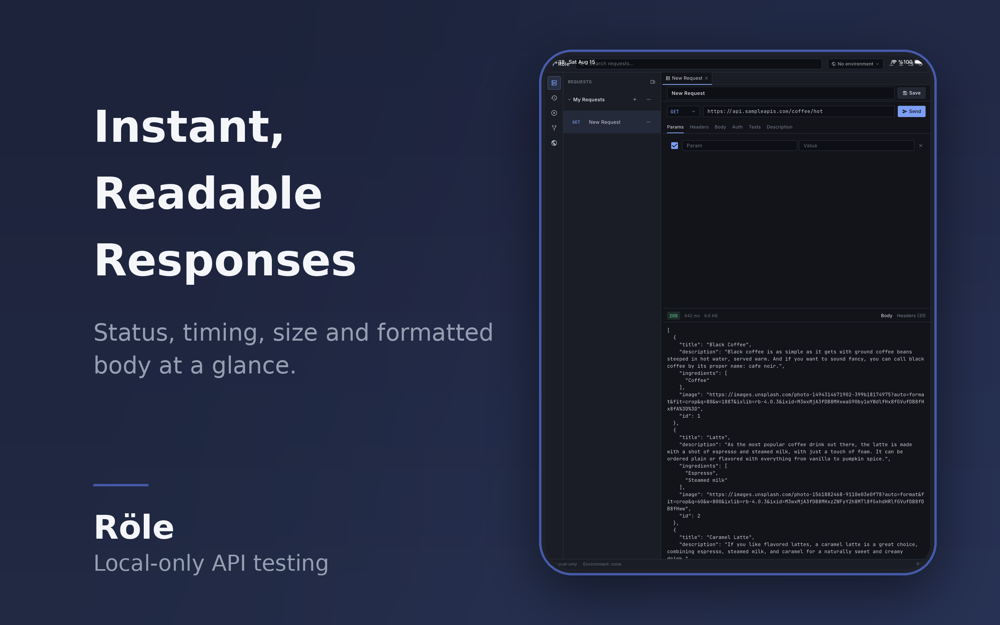
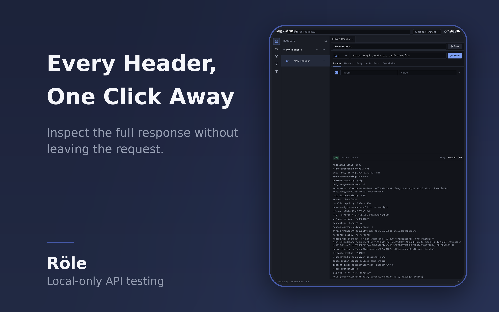
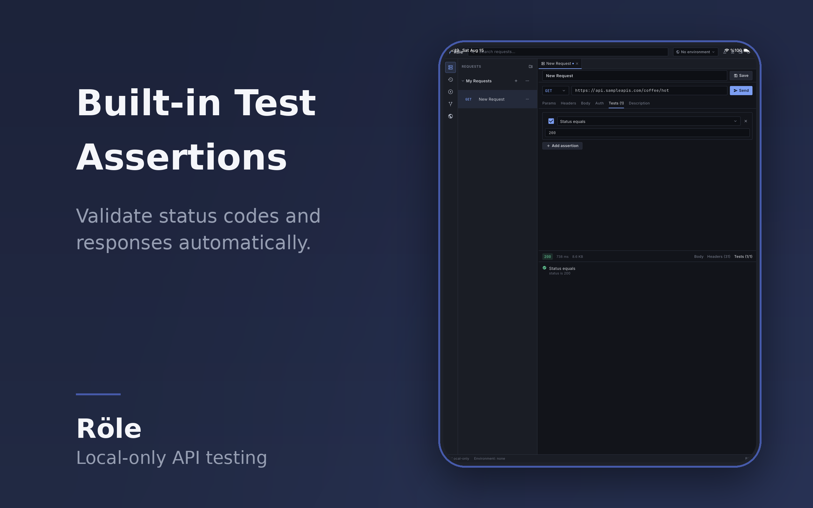
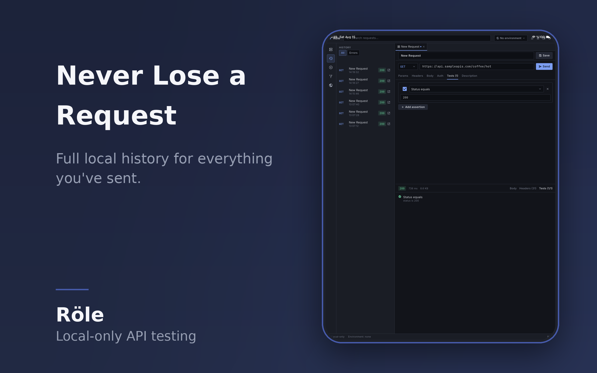
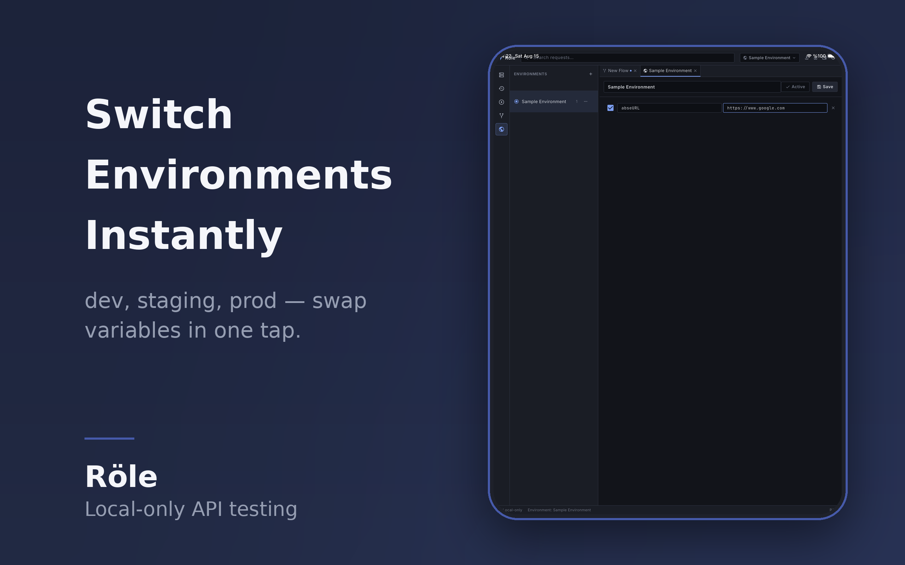
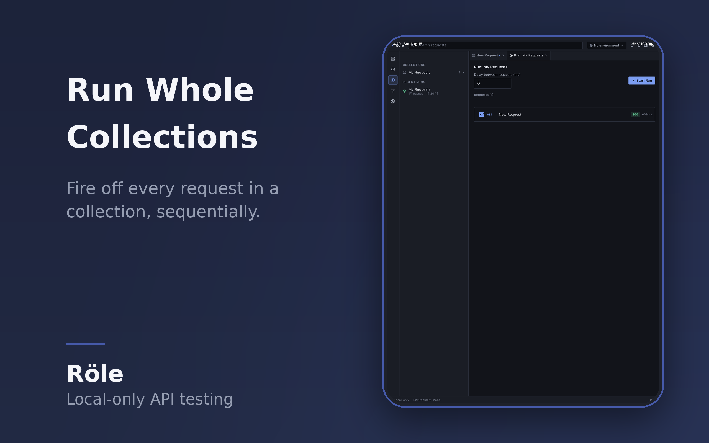
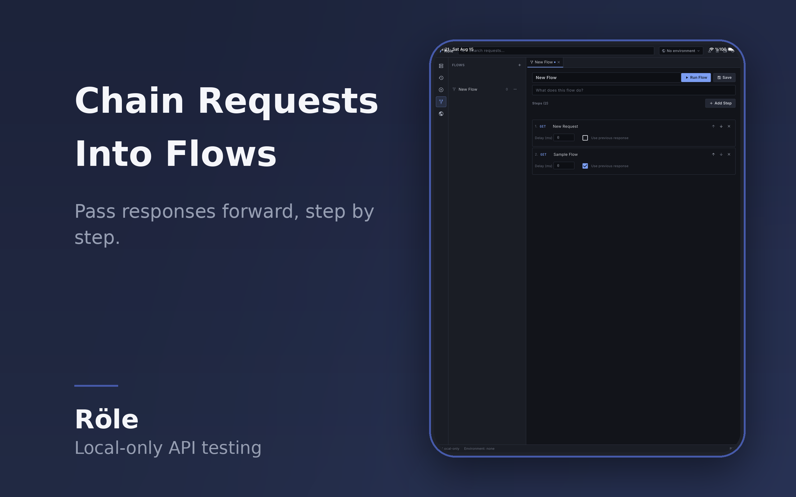

<p align="center">
  
</p>

<h1 align="center">Röle</h1>

<p align="center">
  <strong>A modern, cross-platform API testing client built with Flutter</strong>
</p>

<p align="center">
  <a href="https://github.com/role-suite/role-client/actions/workflows/ci.yml"></a>
  <a href="https://github.com/role-suite/role-client/releases"></a>
  <a href="LICENSE"></a>
  <a href="https://docs.flutter.dev"></a>
  
</p>

<p align="center">
  <a href="#overview">Overview</a> •
  <a href="#features">Features</a> •
  <a href="#screenshots">Screenshots</a> •
  <a href="#installation">Installation</a> •
  <a href="#getting-started">Getting Started</a> •
  <a href="#architecture">Architecture</a> •
  <a href="#technical-documentation">Docs</a> •
  <a href="#contributing">Contributing</a> •
  <a href="#license">License</a>
</p>

---

## Overview

**Röle** is a lightweight API client for testing REST endpoints across desktop and mobile platforms.

By default, all collections, requests, and environments are stored on your device — no account,
no sign-in, no backend server. Optionally, sign in and connect to a [`role-node`](https://github.com/role-suite/role-node)
backend for team-synced workspaces; local-only usage is unaffected either way.

## Features

| Category | What you get |
| --- | --- |
| 🚀 **API Requesting** | `GET`, `POST`, `PUT`, `DELETE`, `PATCH`, `HEAD`, `OPTIONS` · full request editor (URL, headers, query params, body) · response viewer with status, headers, formatted body, and timing · per-request history snapshots |
| 🗂 **Organization & Reuse** | Collections to group requests · environment variables with `{{variableName}}` substitution · active collection/environment selectors · request search & filter |
| 🔁 **Import & Export** | Import Röle or Postman-style workspace JSON · conflict handling (`Skip`, `Keep both`, `Overwrite`) · export your workspace as JSON |
| ⚙️ **Execution & Automation** | **Collection Runner** — run a full collection sequentially · **Run History** — pass/fail summaries for past runs · **Flows** — chain multi-step requests with delays and previous-response passing |
| 🎨 **UX & Platform** | Material 3 UI, responsive desktop/mobile layout · light, dark, and system theme modes · Windows, macOS, Linux, Android, and iOS |

## Screenshots

<table>
  <tr>
    <td align="center" width="50%">
      <br>
      <sub><strong>Home Screen</strong></sub>
    </td>
    <td align="center" width="50%">
      <br>
      <sub><strong>Request List</strong></sub>
    </td>
  </tr>
  <tr>
    <td align="center" width="50%">
      <br>
      <sub><strong>Readable Responses</strong></sub>
    </td>
    <td align="center" width="50%">
      <br>
      <sub><strong>Built-in Assertions</strong></sub>
    </td>
  </tr>
  <tr>
    <td align="center" width="50%">
      <br>
      <sub><strong>Request History</strong></sub>
    </td>
    <td align="center" width="50%">
      <br>
      <sub><strong>Environments</strong></sub>
    </td>
  </tr>
  <tr>
    <td align="center" width="50%">
      <br>
      <sub><strong>Collection Runner</strong></sub>
    </td>
    <td align="center" width="50%">
      <br>
      <sub><strong>Request Flows</strong></sub>
    </td>
  </tr>
</table>

## Installation

### Prerequisites

- [Flutter SDK](https://docs.flutter.dev/get-started/install) `3.44.0` or newer
- Platform development tooling:
  - **Windows**: Visual Studio 2022 with C++ workload
  - **macOS**: Xcode 14+
  - **Linux**: required packages from Flutter Linux docs

### From Source

1. Clone the repository:

   ```bash
   git clone https://github.com/role-suite/role-client.git
   cd role-client
   ```

2. Install dependencies:

   ```bash
   flutter pub get
   ```

3. Run the app:

   ```bash
   # Desktop
   flutter run -d macos
   flutter run -d windows
   flutter run -d linux

   # Mobile
   flutter run -d android
   flutter run -d ios
   ```

### Build for Release

```bash
# Windows
flutter build windows --release

# macOS
flutter build macos --release

# Linux
flutter build linux --release

# Android APK
flutter build apk --release

# iOS
flutter build ios --release
```

### Pre-built Releases

Windows and Linux builds are published automatically to [GitHub Releases](https://github.com/role-suite/role-client/releases) on every version tag. macOS can still be built locally from source (see above); it is not currently part of the automated release pipeline. Android and iOS are distributed through their respective app stores rather than through this repository.

> [!TIP]
> Grab the latest build straight from the [Releases page](https://github.com/role-suite/role-client/releases/latest) — no build tooling required.

## Getting Started

### 1) Create and Send a Request

1. Launch Röle.
2. Create a request from **New Request**.
3. Choose method and URL.
4. Add headers/body as needed.
5. Click **Send** and inspect the response tabs.

### 2) Organize with Collections and Environments

1. Create a collection and attach requests to it.
2. Create environments (for example: dev/staging/prod).
3. Use variables in requests, such as `{{baseUrl}}/users`.
4. Switch active collection/environment from the selectors.

### 3) Run Advanced Flows

- Open **Collection Runner** to execute a full collection and save run history.
- Open **Flows / Request Chain** to configure sequential chained calls.

### 4) Import and Export

- Import a Postman or Röle workspace JSON file from the drawer.
- Export your workspace as JSON to back it up or move it to another device.

## Technical Documentation

Detailed technical docs live in [`docs/`](docs/):

- [Documentation index](docs/README.md)
- [Architecture](docs/02-ARCHITECTURE.md)
- [Development setup](docs/06-DEVELOPMENT.md)
- [Maintenance guide](docs/07-MAINTENANCE.md)

## Architecture

Röle is one persistent workbench shell — a top bar, left rail, contextual sidebar, tabbed
center workbench, and inspector — built on Riverpod notifiers and local JSON storage. No
usecase/repository layers: Röle's state notifiers *are* the data layer.

```text
lib/
├── core/
│   ├── models/       # ApiRequest, Collection, Environment, RequestResult, ...
│   ├── storage/      # JsonStore — local JSON persistence
│   ├── network/      # HttpClient, TemplateResolver, RequestRunner
│   ├── io/           # Workspace export + Röle/Postman import
│   ├── theme/        # Design tokens, colors, typography, ThemeData
│   └── utils/
├── state/            # Riverpod notifiers (workspace, environments, history,
│                      # runs, flows, settings, workbench UI state)
├── ui/
│   ├── shell/          # Persistent shell: top bar, rail, sidebar, workbench, inspector
│   ├── sidebar/         # Requests/collections sidebar panel
│   ├── request/         # Request tab: editor + response viewer
│   ├── environments/    # Environment sidebar panel + editor tab
│   ├── history/          # History sidebar panel + snapshot viewer
│   ├── runner/           # Collection runner + run report tabs
│   ├── flows/            # Flow (request chain) editor + sidebar panel
│   └── widgets/          # Shared design-system widgets
├── app.dart
└── main.dart
```

See [docs/](docs/) for the full architecture writeup.

## Configuration

Key values are in `lib/core/constants.dart`:

- `appName`: display name
- `defaultConnectTimeout`: request connect timeout
- `defaultReceiveTimeout`: response timeout
- `maxHistoryEntriesPerRequest`: history limit per request

Variable syntax (`{{name}}`) is defined in `lib/core/network/template_resolver.dart`.

## Development

```bash
flutter analyze
flutter test
```

## Contributing

Contributions are welcome.

1. Fork the repository.
2. Create a branch (`git checkout -b feature/my-change`).
3. Commit your changes.
4. Push and open a pull request.

Additional guidelines:

- [CONTRIBUTING.md](CONTRIBUTING.md)
- [CODE_OF_CONDUCT.md](CODE_OF_CONDUCT.md)
- [SECURITY.md](SECURITY.md)

## FAQ

### What is Röle?

"Röle" means "relay" in Turkish. The app relays API requests and responses between you and your services.

### Where is data stored?

Locally, on-device by default. If you sign in and connect to a `role-node` backend, workspaces
you join are also synced there — everything else stays local.

### Do I need an account?

No. Accounts, sign-in, and sync are entirely optional — Röle works fully offline with no
account, and everything you create stays on your device unless you opt into a synced workspace.

## License

This project is licensed under the MIT License. See [LICENSE](LICENSE).

---

<p align="center">
  <sub>Made with ❤️ and Flutter — if Röle is useful to you, consider giving it a ⭐</sub>
</p>
